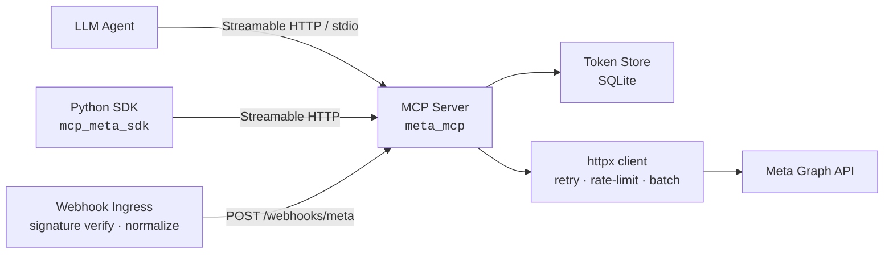
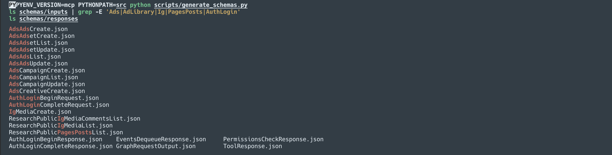

# Meta Graph MCP Server

[](https://github.com/jpalvarezb/meta_graph_mcp/actions/workflows/ci.yml)
[](https://www.python.org/downloads/)
[](LICENSE)

Agents can't safely automate Meta's ads and content APIs without OAuth, rate limiting, PPCA enforcement, and webhook handling. This MCP server packages all of that into a typed tool surface any LLM agent can call, plus a Python SDK for direct use.

Built as an [OpenAI MCP](https://github.com/modelcontextprotocol) server, it exposes a production-ready surface area covering research, insights, publishing, ad creation, and webhook-driven workflows against the Meta Graph and Marketing APIs.

## Architecture



## Highlights
- **Typed MCP tool surface** — research, insights, assets, publishing, and ads operations with PPCA enforcement, IG Business checks, and publish caps.
- **Resilient HTTP client** — `httpx` with retry/backoff, per-token and global rate limiting, batching, and pagination.
- **Async SDK** — `mcp_meta_sdk` connects via Streamable HTTP with typed wrappers and high-level helpers (IG publish, scheduled posts, campaign stack, insights, ad library search).
- **Batteries included** — Alembic migrations, pytest + respx tests, Ruff/Black/Mypy CI, Docker multi-stage build, and runnable examples.

## Repository Layout
```
meta_graph_mcp/
├─ src/meta_mcp/          # MCP server implementation
├─ src/mcp_meta_sdk/      # Public SDK package
├─ tests/                 # pytest suite
├─ schemas/               # JSON Schemas for tool I/O
├─ scripts/examples/      # runnable workflow samples
├─ alembic/               # database migrations
├─ docker/                # container build assets
└─ .github/workflows/     # CI pipelines
```

## Prerequisites
- Python 3.11+
- Meta app credentials with required Graph/Marketing API scopes
- SQLite (bundled) or alternative DB supported by SQLAlchemy if you customise `META_MCP_DATABASE_URL`

## Quick Start
1. **Create a virtual environment & install dependencies**
   ```bash
   python3.11 -m venv .venv
   source .venv/bin/activate
   pip install -U pip
   pip install -e .[dev]
   ```
2. **Configure environment variables**
   Copy `.env.example` to `.env` and populate:
   ```bash
   cp .env.example .env
   # edit values
   ```
   You must supply credentials for your own Meta App. Create one (or use an existing one) at [developers.facebook.com](https://developers.facebook.com), then copy the App ID and App Secret from the app's **Settings → Basic** page. Generate the appropriate access tokens for whichever surface you need (Page, Instagram Business, Ad Account, or System User) and add them here.

   Required values:
   - `META_MCP_APP_ID` / `META_MCP_APP_SECRET`
   - `META_MCP_VERIFY_TOKEN`
   - Access tokens (Page, IG Business, Ad Account, System User) with scopes:
     - Pages: `pages_read_engagement`, `pages_read_user_content`, `pages_manage_posts`, `pages_manage_engagement`, `pages_read_insights`, `pages_manage_metadata`
     - Instagram: `instagram_basic`, `instagram_manage_insights`, `instagram_content_publish`, `instagram_manage_comments`, `pages_show_list`, `business_management`
     - Ads: `ads_management`, `ads_read`, `business_management`
     - PPCA where required (`page_public_content_access`)

3. **Run database migrations**
   ```bash
   alembic upgrade head
   ```
4. **Start the MCP server**
   ```bash
   meta-mcp-server --transport streamable-http
   # or stdio/sse depending on integration target
   ```
   The server exposes:
   - Streamable HTTP: `POST/GET /mcp`
   - Webhooks: `POST/GET /webhooks/meta`
5. **Use the SDK**
   ```python
   import asyncio
   from mcp_meta_sdk import MetaMcpSdk
   from meta_mcp.meta_client import InsightsAdsAccount

   async def main():
       async with MetaMcpSdk(base_url="http://localhost:8000") as sdk:
           report = await sdk.ads_insights_report(
               InsightsAdsAccount(
                   ad_account_id="123456789",
                   fields=["impressions", "spend"],
                   level="ad",
                   time_range={"since": "2024-01-01", "until": "2024-01-31"},
               )
           )
           print(report)

   asyncio.run(main())
   ```
6. **User authentication** — see [docs/AUTH.md](docs/AUTH.md) for the OAuth login flow.

## Docker
Multi-stage Dockerfile (Alpine builder + distroless runtime) available at `docker/Dockerfile`.

```bash
# Build
docker build -t meta-mcp:latest -f docker/Dockerfile .

# Run (env file contains credentials/tokens)
docker run --rm -p 8000:8000 --env-file .env meta-mcp:latest meta-mcp-server --transport streamable-http
```

## Webhooks
- Verify token handshake supported at `GET /webhooks/meta` (`hub.challenge` echo).
- Incoming deliveries validated with `X-Hub-Signature-256` using the app secret.
- Normalised entries persisted to `webhook_events` and available via `events.dequeue` MCP tool.

## Example Workflows
### Instagram Image Publish
1. `ig.media.create` (IMAGE) → captures `creation_id`.
2. `ig.media.publish` with IG Business checks + PPCA enforcement.
3. SDK helper: `MetaMcpSdk.publish_ig_image` orchestrates creation + publish.

### Scheduled Page Post
1. `pages.posts.publish` with `published=false` and `scheduled_publish_time`.
2. SDK helper: `MetaMcpSdk.schedule_page_post`.

### Campaign → Ad Set → Creative → Ad
1. `ads.campaigns.create`
2. `ads.adsets.create`
3. `ads.creatives.create`
4. `ads.ads.create`
5. SDK helper: `MetaMcpSdk.create_campaign_stack`

### Ads Insights with Breakdowns
1. `insights.ads.account` specifying `fields`, `level`, `time_range`, `breakdowns`.
2. SDK helper: `MetaMcpSdk.ads_insights_report`.

### Ad Library Search by Page IDs
1. `research.ad_library.by_page` (country-scope aware).
2. SDK helper: `MetaMcpSdk.ad_library_search_by_pages`.

## JSON Schemas
Tool input/output schemas are generated from the Pydantic models into the `schemas/` directory (see `scripts/generate_schemas.py`). They can be consumed by agents to understand argument/response shapes ahead of invoking a tool.




## Testing
- Unit tests: `pytest`
- Async HTTP and retry behaviour: `pytest-asyncio` + `respx`
- Coverage enforced at ≥60% on `meta_mcp` and `mcp_meta_sdk`

Run locally:
```bash
pytest --cov=meta_mcp --cov-report=term-missing --cov=mcp_meta_sdk
```

## Development
```bash
ruff check src tests
black src tests
mypy src tests
```

## Production Notes
- Configure PPCA via App Review
- Ensure IG Business linkage for publishing
- Monitor `x-business-use-case-usage` / `x-app-usage` headers surfaced in tool responses
- Manage idempotency keys when creating media/assets/ads

## License
[MIT](LICENSE)
